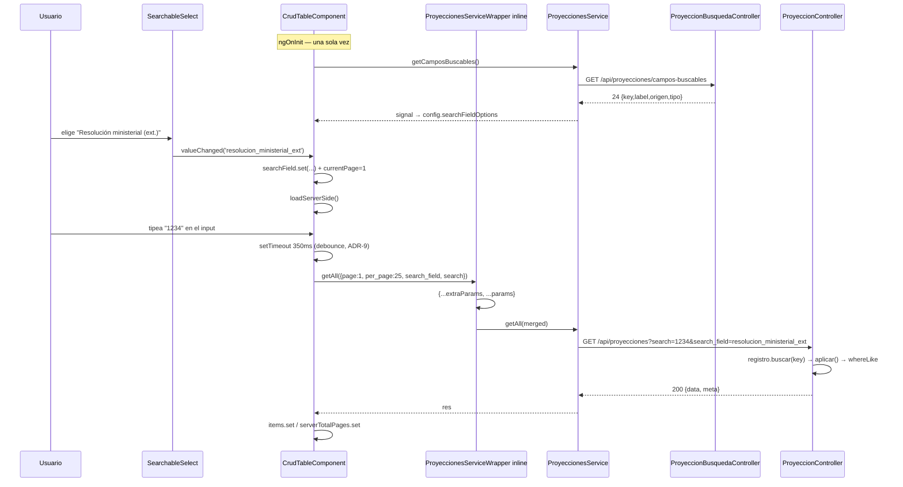

# Design: Búsqueda avanzada en el listado de proyecciones

## Enfoque técnico

Un **registro declarativo** en el backend (`RegistroCamposBuscables`) es la única fuente de verdad de
qué se puede buscar. De él se derivan **dos** artefactos: (a) las cláusulas WHERE del listado y
(b) el payload de `GET /api/proyecciones/campos-buscables`, que es lo único que alimenta el picker
"Buscar en ▾" del `CrudTable` genérico. El frontend manda un `key` público, nunca un nombre de columna.

Tres propiedades quedan congeladas por diseño: (1) `search` sin `search_field` se comporta **exactamente**
como hoy; (2) la cadena `OR` heredada es un **literal congelado**, no se reconstruye desde el registro;
(3) `search_field` desconocido degrada a `__all__` en vez de romper.

Tag de requisitos: **`BUSQ`** → `REQ-BUSQ-{N}` / `SCENARIO-N`.

## Verificaciones previas (ejecutadas, no asumidas)

Todo lo de esta tabla se comprobó corriendo código contra SQLite `:memory:` y contra el PostgreSQL local
antes de diseñar. Las decisiones de abajo salen de acá, no de theory-crafting.

| # | Hecho | Cómo se verificó | Consecuencia de diseño |
|---|---|---|---|
| V1 | `ILIKE` en SQLite **compila bien y explota al ejecutar**: `SQLSTATE[HY000]: General error: 1 near "ILIKE": syntax error` | `PDO::query('SELECT … ILIKE ?')` | El test de portabilidad **DEBE ejecutar** la query. Inspeccionar `toSql()` daría verde en dev y explotaría después. |
| V2 | `whereLike($c,$v,false)` → `"pi"."estado"::text ilike ?` en PG, `"pi"."estado" like ?` en SQLite | `php artisan tinker --execute` sobre ambas conexiones | Un solo código, dos motores. Es el constructor correcto para migrar el bloque `ILIKE`. |
| V3 | `PostgresGrammar::whereBasic` (líneas 56-62) inyecta `%s::text` en **todo** operador `like`/`ilike` | lectura del vendor + `toSql()` | El `::text` de `fecha` sale solo en PG ⇒ **no** se puede confiar en él. Hay que emitir el `CAST` explícito. |
| V4 | `prepareWhereLikeBinding` de SQLiteGrammar (líneas 71-78) reescribe el valor **solo** si `$caseSensitive === true` (para GLOB) | lectura del vendor | `whereLike` **no escapa** `%` ni `_`. Hay que hacerlo nosotros, en un solo lugar. |
| V5 | PG: `ILIKE '%100\%%'` matchea **solo** `100%`. `ILIKE '%a\_b%'` matchea **solo** `a_b` | `psql` contra la DB local | El backslash es el carácter de escape **por defecto** en PG ⇒ escapar con `\` no necesita cláusula `ESCAPE`. |
| V6 | SQLite: `LIKE '%100\%%'` devuelve `[]`; recién `LIKE '%100\%%' ESCAPE '\'` matchea `100%` | `PDO::query` | En SQLite el escapado **degrada** (el `\` es literal). El test **no** puede afirmar semántica literal en SQLite — sólo que la query **ejecuta**. Ver ADR-5. |
| V7 | SQLite `LIKE` es insensible a mayúsculas para ASCII: `LIKE '%AXB%'` matchea `axb` | `PDO::query` | Un test de insensitividad sobre SQLite es válido. |
| V8 | `whereLike` **funciona dentro de `whereHas`** (closures Eloquent), incluso anidado, con columnas sin calificar | `tinker`: cadena `whereHas('instrumentos')→whereHas('cargo')` | `origen=relacion` se resuelve con `whereHas`, sin JOIN. Ver ADR-3. |
| V9 | **Un `btree` sobre `varchar` NO sirve para `LIKE '%…%'`**: PG ya castea solo → `Filter: ((estado)::text ~~ 'valor\_1%')` + `Seq Scan` sobre 20.000 filas con índice presente | `EXPLAIN` con índice btree creado | El cast implícito `varchar::text` es el motivo real, **no** el wildcard. Por eso el umbral de revisita de ADR-12 es trigram y no "agregar un índice más". |

## Las 4 trampas y cómo las cerramos

### Trampa 1 — `toSql()` no valida `ILIKE`

El SQL se arma como string; SQLite no lo parsea hasta ejecutar. Un test que sólo haga
`assertStringContainsString('ILIKE', $query->toSql())` **pasa en verde** y revienta en producción
—justo al revés de lo que el test pretende. Por eso la fase de testing **obliga** a
`$this->getJson(...)->assertOk()` contra `DB_CONNECTION=sqlite`: lo que se asserta es el **status HTTP**,
que sólo puede ser 200 si la query se ejecutó de verdad. Ese test hoy fallaría (V1), y por eso es
obligatorio migrar el `ILIKE` heredado a `whereLike` **en el mismo cambio**: sin eso el camino `__all__`
queda intestable y el bloque heredado queda en unaignorancia que nadie puede detectar.

### Trampa 2 — `whereLike` no escapa `%` ni `_`

`prepareWhereLikeBinding` (V4) no toca nada cuando `caseSensitive: false`. El término del usuario se
envuelve en `%…%` **crudo**, así que un `_` en la caja de búsqueda matchea cualquier carácter
(`SM-2025_01` devuelve de más) y un `%` devuelve todo.

> **Corrección al proposal**: esto **no** es un problema de performance. El seq scan ocurre igual con
> término escapado o no, porque el wildcard inicial ya lo fuerza (V9). Lo que el escapado compra es
> **corrección de resultados**, no velocidad. El proposal lo enunció como riesgo de performance; queda
> corregido acá.

El escapado vive en **un método privado del aplicador**, no inline en el controller:
`RegistroCamposBuscables::escaparLike(string $termino): string`, aplicado **antes** de envolver en `%…%`
y en **ambos** caminos (`__all__` y campo único). Si viviera en el controller volvería a haber dos
puntos de escapado y ninguno sería auditable.

### Trampa 3 — orden de rutas

`routes/api.php:40` declara `Route::apiResource('proyecciones', ProyeccionController::class)`, que
registra `GET proyecciones/{proyeccion}`: `campos-buscables` es un string válido y **matchea** ese
placeholder. Si la ruta nueva se declara después, Laravel la resuelve como `{proyeccion}` y el
endpoint responde 404 o intenta model binding.

**Punto de inserción exacto**: `routes/api.php` **después de la línea 32**
(`Route::get('proyecciones/opciones-filtro', …)`) y antes de la línea 33
(`stats/by-institucion`), con el `use App\Http\Controllers\Api\ProyeccionBusquedaController;` en el
bloque de imports (líneas 5-16, en orden alfabético). El precedente ya existe: `opciones-filtro`
vive exactamente ahí. Hay un **test de regresión de ruteo** (§Testing) porque un reordenamiento
futuro del archivo rompe esto en silencio.

### Trampa 4 — el `is_numeric` NO es un bug de sintaxis

`ProyeccionController.php:102-104` genera `WHERE (proyecciones.id = 123 OR pi.estado ILIKE …)`, que es
**SQL válido**. El problema es de **producto**: buscar `123` devuelve la fila con ese id **más** todo lo
que contenga `123`.

**Decisión: CONGELAR `__all__` tal como está hoy.** No se "corrige" la rama numérica. El match exacto
se expone por `search_field=id` (`tipo=numero` ⇒ igualdad, ADR-2). Razón: `search` sin `search_field`
tiene otros consumidores (`export-dialog`, cualquier cliente futuro) y cambiar su semántica es un
cambio de producto disfrazado de refactor. Si alguien "arregla" esa rama más adelante, rompe el contrato
en silencio. Este párrafo **es** la documentación que lo impide.

> **Única excepción, y es deliberada**: el escapado de `%`/`_` sí se aplica también a `__all__`. Sin
> eso, `__all__` — que es la opción **por defecto** del picker — dejaría el agujero abierto y la
> corrección sería cosmética. Diferencia observable: un término con `%`/`_` literal ahora matchea
> literal en vez de como wildcard. Hoy devuelve basura o todo; mañana devuelve lo que el usuario
> escribió. Es una mejora estricta y va cubierta por test (§Testing).

## Architecture Decisions

### ADR-1: El registro deriva los WHERE **y** el endpoint; el frontend nunca manda columnas

**Contexto**: hoy el backend tiene tres whitelists desincronizadas (`COLUMNAS_INSTRUMENTO`,
`COLUMNAS_PLAZA`, `$allowedSorts`) y el frontend tendría su propia lista de campos.

**Decisión**: `RegistroCamposBuscables` es la única fuente de verdad. `GET /api/proyecciones/campos-buscables`
serializa `opciones()` y el frontend pinta lo que llega. El param `search_field` se resuelve **siempre**
contra ese array (`buscar($key)`); **no existe** ningún camino de código donde un string de la request
llegue a un nombre de columna.

**Alternativa**: lista hardcodeada en el frontend + `columna` derivada por convención (`pi.` + key).
**Descartada**: dos fuentes de verdad que divergen en silencio, y un mapeo por convención es
precisamente el punto donde un key mal escrito se convierte en columna inyectada.

### ADR-2: La cadena `OR` heredada es un literal **congelado**, no se reconstruye desde el registro

**Contexto**: la opción 5 del proposal ("mueve el bloque al registro") es la trampa 4 con otro nombre.

**Decisión**: `__all__` se resuelve en un método privado propio —`aplicarBusquedaTodosLosCampos()`— que
contiene la lista heredada **explícita**. El registro sirve sólo el camino de campo único.

**Rationale**:
1. La cadena heredada **no es un subconjunto** del registro: tiene la rama `is_numeric` y excluye
   deliberadamente los 10 campos nuevos. Reconstruirla desde el registro obligaría a elegir entre
   *cambiar* `__all__` (agregar los 10) o *perder* la rama numérica. Ambas son cambios de producto.
2. Congelarla deja el invariante auditable en un solo lugar, legible de un tirón.
3. El único cambio dentro del literal es `ILIKE` → `whereLike` (obligatorio por V1) y el escapado.

**Alternativa**: derivar `__all__` = OR de todos los campos del registro. **Descartada**: es la
"abstracción territoriale" clásica — cuando el comportamiento legado y el modelo no coinciden, el modelo
miente.

### ADR-3: Campos de relación con `whereHas` (EXISTS), nunca JOIN

**Contexto**: `institucion.nombre`, `institucion.localidad`, `cargo.nombre`, `cargo.codigo`,
`resolucion.nombre` no son columnas del listado.

**Decisión**: `whereHas` anidado (V8). Un `JOIN` a `instituciones`/`cargos` **multiplicaría filas**
(proyecciones × instrumentos) y rompería `paginate()->total()` y `select('proyecciones.*')` —el listado
muestra una fila por plaza, no una por combinación. `EXISTS` no duplica y no necesita `distinct`.

**`anioScope`**: `cargo` y `resolucion` se alcanzan por `['instrumentos','cargo']` con `anioScope: true`,
porque la relación `instrumentos` abarca **todos** los años y sin acotar matchearía el cargo de 2023
desde un listado de 2025. `institucion` es atributo de la plaza → `['institucion']`, `anioScope: false`.
Es el mismo razonamiento que ya aplica el código heredado en las líneas 117-124.

> `nivel.nombre` **no entra** al registro: el proposal fija 23 campos y el criterio de éxito dice "24
> entradas". El nivel ya es un filtro dedicado (`?id_nivel=`) y sumarlo al picker sería duplicar UI.
> El mecanismo lo soporta sin cambios (`['nivel']`), así que agregarlo después es una línea.

### ADR-4: `tipo=fecha` emite `CAST(... AS TEXT)` explícito

**Contexto**: V3 — en PG, `whereLike` ya castea a `::text`; en SQLite **no**.

**Decisión**: el aplicador envuelve la columna en `DB::raw("CAST({$col} AS TEXT)")` cuando
`tipo === Fecha`. La interpolación es sobre una **constante de clase**, jamás sobre input de request.

**Alternativa**: no castear y confiar en el `::text` de PG. **Descartada**: el camino se rompe solo en
SQLite, o sea justo donde corren los tests, y el fallo aparece en CI y no en producción. Conflicto de
portabilidad invertido.

### ADR-5: Escapado con backslash en un método único, con el límite de SQLite documentado

**Decisión**: `escaparLike()` aplica `['\\' => '\\\\', '%' => '\%', '_' => '\_']` **antes** del
`%…%`. En PG es correcto sin cláusula `ESCAPE` (V5). En SQLite degrada (V6).

**Consecuencia asumida y documentada**: los tests **no** afirman la semántica literal del escapado en
SQLite; afirman (a) `escaparLike()` como función pura, exacta, independiente del driver, y (b) que una
query con `%`/`_` en el término **ejecuta** y devuelve un conjunto acotado. La exactitud en PG del
escapado queda como paso de **QA manual** contra la DB real (comando en §Testing), porque automatizarlo
exigaría una conexión PG en CI que este proyecto no tiene.

**Alternativa**: `ESCAPE '\'` explícito vía `whereRaw`. **Descartada**: obliga a ramificar por driver
y el resultado sería que **la rama que se testea es la de SQLite y la de producción queda sin cubrir** —
testeamos el camino equivocado, que es peor que no testear.

### ADR-6: `tipo=numero` ⇒ igualdad; término no numérico ⇒ conjunto vacío

**Decisión** (semántica completa por `tipo` en § Contrato de datos):

| `tipo` | SQL | Nota |
|---|---|---|
| `texto`, `enum` | `whereLike($col, "%$patron%", caseSensitive: false)` | contención insensible |
| `numero` | `where($col, (int) $termino)` | **exacto** |
| `numero` + término no numérico | `whereRaw('0 = 1')` | conjunto vacío |
| `fecha` | `whereLike(DB::raw("CAST($col AS TEXT)"), "%$patron%", false)` | ADR-4 |

`numero` es lo que **arregla el problema de producto** del `is_numeric` sin tocar `__all__`: buscar
`123` con `search_field=id` devuelve exactamente la proyección 123.

**Por qué el conjunto vacío y no "ignorar el filtro"**: ignorar el filtro devolvería **todas** las
filas ante un error de tipeo —peor que una lista vacía, porque el usuario cree que filtró.

**`enum` vs `texto` produce el mismo SQL**: containment es lo correcto para tipear "Aut" → "Autorizado".
La distinción `enum` es de **documentación y futuro de UI** (un `datalist` de valores posibles), no de SQL.
Se declara explícitamente para que nadie la lea como una diferencia de comportamiento.

### ADR-7: `search_field` desconocido ⇒ fallback a `__all__` + `Log::warning` (no 422)

> Esto **refina** un criterio de éxito del proposal ("un `search_field` desconocido se rechaza (422)").
> La fase de specs debe codificar el fallback, no el 422. Justificación:

1. **No hay estado de error en el `CrudTable`.** `loadServerSide()` (líneas 635-638) sólo hace
   `console.error` + `serverLoading(false)`. Un 422 se renderiza como tabla vacía sin mensaje.
2. **El único productor es el picker, alimentado por el endpoint.** Un key desconocido sólo puede venir
   de un cliente stale (bundle viejo contra endpoint nuevo) o de una URL a mano. En el caso stale, 422
   rompe una página que **funcionaba**; el fallback la degrada al comportamiento de hoy.
3. **La seguridad no depende de la política**: el key se resuelve contra un array fijo. Un miss
   devuelve `null` y corre la rama congelada. No hay interpolación posible.
4. **Precedente en el mismo archivo**: `aplicarOrden()` ya degrada en silencio `sort_by` desconocido a
   `'id'` (líneas 368-371) y `sort_dir` a `'desc'`. Consistencia con la convención de la casa.
5. El `Log::warning` convierte "lenient" en "responsable": la deriva se ve en los logs de Railway.

Entrada a normalizar: `$raw = $request->input('search_field'); $key = is_string($raw) ? trim($raw) : null;`
— `is_string` evita que `?search_field[]=x` reviente el `Request::string()`.

### ADR-8: `search_field` viaja en el bloque propio del `CrudTable`, **después** del `Object.assign` de extras

**Contexto**: `getExtraParams()` es duck-typing: no está en `CrudService` ni en `ServerSideCrudService`
(verificado: `crud-config.interface.ts` no lo declara) y se resuelve con `this.service?.getExtraParams?.()`
en la línea 624.

**Decisión**: `search` y `search_field` se escriben en `params` **después** del
`Object.assign(params, extraParams)` (línea 625), no antes. El picker y la caja de texto son estado de UI:
**ellos** tienen la última palabra.

**Rationale**: `Object.assign` overwrite silenciosamente. Hoy `extraParams` precede a `search`, así que
un wrapper que mandara `search` pisaría el input del usuario. Mover ambos al final elimina esa clase de
bug de una, sin ampliar la duck-typing ni tocar `ProyeccionesServiceWrapper` (que es **inline** en
`proyecciones-list.component.ts:26-81`, no un archivo propio — no hay dónde tiparlo sin refactor extra).
Verificado además que el contrato del wrapper es hoy `id_nivel|id_resolucion|localidad|anio` (líneas
1073-1076), o sea que no hay colisión real: es prevention, no bugfix.

**Alternativa**: mandar `search_field` por `getExtraParams()`. **Descartada**: el wrapper no tiene
conocimiento del picker, el `CrudTable` seguiría siendo genérico-rotura y se crecería una duck-typing
que el proposal explícitamente NO quería ampliar.

### ADR-9: debounce con `setTimeout` imperativo, NO con `effect()`

**Contexto**: la app es zoneless (`provideZonelessChangeDetection()` en `app.config.ts`) y el propio
código deja escrito el motivo en `agregar-instrumento-dialog.component.ts:743-745`:
*"Se dispara desde el template con `(ngModelChange)` porque el componente es zoneless: un effect no
garantiza el re-render."*

**Decisión**: `onSearch()` limpia el timer anterior y arma uno con `setTimeout`. El callback escribe
`searchTerm` + `currentPage` y llama `loadServerSide()` desde **dentro** del handler de template, que es
la vía que el codebase ya probó (`SearchableSelectComponent.open()` y `scrollHighlightedIntoView()` usan
exactamente `setTimeout` → `signal.set`).

**Alternativas**: `effect()` sobre `searchTerm` → rechazado por la nota del codebase. RxJS
`debounceTime` + `toSignal` → agrega una dependencia y una capa de indirección para 6 líneas. `signal`
de "pending" → más estado para el mismo efecto.

`searchTerm()` alimenta **las dos** ramas (client-side `filteredItems` y `loadServerSide()`), así que el
debounce frena también el re-filtrado client-side de los 6 CRUDs — que es exactamente el objetivo.

### ADR-10: Mover `SearchableSelectComponent` a `shared/` (inversión de dependencia)

**Contexto**: el componente vive en `features/shared/components/searchable-select/`. El `CrudTable` vive
en `shared/components/crud-table/`. Si el `CrudTable` lo importara desde `features/`, **`shared`
dependería de `features`** — la dirección invertida de la arquitectura.

**Decisión**: `git mv` a `shared/components/searchable-select/searchable-select.ts`. Los **5** importadores
se actualizan en la **misma fase** (tabla en §File Changes). El componente **no se modifica**: se
reusa tal cual, con `options: {id,label}[]` y `value: model<number|string|null>` — el `key` del registro
es el `id` y el label español es el `label`. Cero cambios de comportamiento en los 5 usos existentes.

### ADR-11: `reloadData()` resetea `currentPage` a 1

**Contexto**: `reloadData()` (línea 642) llama `loadItems()` sin tocar `currentPage`. En la página 5,
cambiar año/nivel pide la página 5 del set nuevo → tabla vacía.

**Decisión**: `reloadData() { this.currentPage.set(1); this.loadItems(); }`.

**Impacto enumerado — 6 call sites**, todos en `proyecciones-list.component.ts`:
`1079` (effect `filtrosEffect`, cambio de nivel/resolución/localidad/año — **el caso que loBUGuea**),
`1359`, `1531` (post-`save` del modal), `1625`, `1650`, `1665`. Los 6 ganan: siempre quieren la
primera página del conjunto nuevo. Es la corrección de un bug, no un cambio de semántica.

`deleteItem()` (línea 726) llama `loadItems()` directo y queda fuera de este cambio a propósito:
después de borrar conviene quedarse en la página actual.

También se agrega `ngOnDestroy` (hoy sólo `implements OnInit`) para limpiar el timer del debounce:
sin eso, un `reloadData()`Navigation pendiente dispara un GET contra un componente destruido.

### ADR-12: El endpoint de descubrimiento **no** se cachea

**Decisión**: sin `Cache::remember`, sin ETag.

**Rationale**: el payload se deriva de una constante de clase de 23 entradas. El costo es ~0 en CPU; lo
único que se paga es el round-trip HTTP, y cachear en servidor metería un problema de invalidación
(staleness + eviction) a cambio de nada. Lo que sí se cachea es **en el cliente**: `proyecciones-list`
lo pide **una vez** en `ngOnInit` a un signal y el `CrudTable` lo consume vía `config`.

## Contrato de datos

### `CampoBuscable` (VO readonly)

```php
final readonly class CampoBuscable
{
    /**
     * @param  list<string> $relacion  cadena de relaciones desde Proyeccion.
     *   Vacía cuando origen !== Relacion. Ej: ['institucion'] | ['instrumentos','cargo'].
     */
    public function __construct(
        public string $key,                    // key público (lo que viaja por HTTP)
        public string $label,                  // label en español (lo que ve el usuario)
        public OrigenCampoBuscable $origen,    // Instrumento | Plaza | Relacion
        public TipoCampoBuscable $tipo,        // Texto | Numero | Fecha | Enum
        public string $columna,                // ver nota
        public array $relacion = [],
        public bool $anioScope = false,
    ) {}

    public static function columna(string $col): self;   // instrument/plaza
    public static function viaRelacion(string $key, string $label, string $col,
        array $cadena, bool $anioScope = false): self;   // relacion
}
```

**`columna` es siempre no-null** y significa "la columna, calificada exactamente como hace falta en el
punto de aplicación": `proyecciones.id` / `pi.estado` para `origen=Plaza|Instrumento`; `nombre` /
`codigo` **sin calificar** para `origen=Relacion`, porque dentro del `EXISTS` el scope ya es la tabla
del último salto (V8).

### Enums

```php
enum OrigenCampoBuscable: string { case Instrumento='instrumento'; case Plaza='plaza'; case Relacion='relacion'; }
enum TipoCampoBuscable: string   { case Texto='texto'; case Numero='numero'; case Fecha='fecha'; case Enum='enum'; }
```

### Registro — 23 campos

`__all__` **NO es** un `CampoBuscable`: es `RegistroCamposBuscables::SENTINEL_TODOS = '__all__'`,
una constante aparte. Razón: un campo siempre **tiene** origen y tipo (propiedades no-nullables), y un
sentinel no los tiene. `opciones()` lo antepone sintético ⇒ el endpoint devuelve **24** entradas.

| # | `key` | `label` | `origen` | `columna` | `relacion` / `anioScope` | `tipo` |
|---|---|---|---|---|---|---|
| 1 | `id` | ID de proyección | Plaza | `proyecciones.id` | — | **numero** |
| 2 | `id_puesto` | ID de puesto | Plaza | `proyecciones.id_puesto` | — | texto |
| 3 | `estado` | Estado | Instrumento | `pi.estado` | — | enum |
| 4 | `motivo` | Motivo | Instrumento | `pi.motivo` | — | enum |
| 5 | `anio` | Año | Instrumento | `pi.anio` | — | texto |
| 6 | `n_expediente` | N° de expediente | Instrumento | `pi.n_expediente` | — | texto |
| 7 | `resolucion_ministerial` | Resolución ministerial | Instrumento | `pi.resolucion_ministerial` | — | texto |
| 8 | **`resolucion_ministerial_ext`** | Resolución ministerial (ext.) | Instrumento | `pi.resolucion_ministerial_ext` | — | texto |
| 9 | **`disposicion_sgnij`** | Disposición SGNIJ | Instrumento | `pi.disposicion_sgnij` | — | texto |
| 10 | **`rect_disposoco_sgnij`** | Rectificación disposición OCO SGNIJ | Instrumento | `pi.rect_disposoco_sgnij` | — | texto |
| 11 | **`resolucion_ministerial_rect1`** | Resolución ministerial (rect. 1) | Instrumento | `pi.resolucion_ministerial_rect1` | — | texto |
| 12 | **`resolucion_ministerial_rect2`** | Resolución ministerial (rect. 2) | Instrumento | `pi.resolucion_ministerial_rect2` | — | texto |
| 13 | **`resolucion_previa_continuidad`** | Resolución previa de continuidad | Instrumento | `pi.resolucion_previa_continuidad` | — | texto |
| 14 | **`destino_anterior`** | Destino anterior | Instrumento | `pi.destino_anterior` | — | texto |
| 15 | `destino_nuevo` | Destino nuevo | Instrumento | `pi.destino_nuevo` | — | texto |
| 16 | **`observaciones`** | Observaciones | Instrumento | `pi.observaciones` | — | texto |
| 17 | **`fecha_desde`** | Fecha desde | Instrumento | `pi.fecha_desde` | — | fecha |
| 18 | **`fecha_hasta`** | Fecha hasta | Instrumento | `pi.fecha_hasta` | — | fecha |
| 19 | `institucion_nombre` | Institución | Relacion | `nombre` | `['institucion']` / `false` | texto |
| 20 | `institucion_localidad` | Localidad | Relacion | `localidad` | `['institucion']` / `false` | texto |
| 21 | `cargo_nombre` | Cargo | Relacion | `nombre` | `['instrumentos','cargo']` / **`true`** | texto |
| 22 | `cargo_codigo` | Código de cargo | Relacion | `codigo` | `['instrumentos','cargo']` / **`true`** | texto |
| 23 | `resolucion_nombre` | Resolución (nombre) | Relacion | `nombre` | `['instrumentos','resolucion']` / **`true`** | texto |

**En negrita: los 10 que hoy no son buscables.** `columna` verificado contra
`2026_09_24_000001` + `2026_09_24_000002` + `2026_04_29_000001` (`proyecciones`: `id_puesto`).

### API del registro

```php
final class RegistroCamposBuscables
{
    public const SENTINEL_TODOS = '__all__';

    /** @return list<CampoBuscable> */
    public function todos(): array;                  // 23, memoizado en propiedad readonly

    public function buscar(string $key): ?CampoBuscable;   // null si no existe → __all__

    /** @return list<array{key:string,label:string,origen:?string,tipo:?string}> */
    public function opciones(): array;                // 24 entradas, __all__ primero

    /** Punto único de concatenación de columnas. $patron YA viene escapado. */
    public function aplicar(Builder $query, CampoBuscable $campo, string $termino, string $anio): void;

    /** Único punto de escape de wildcards. */
    public static function escaparLike(string $termino): string;
}
```

**`aplicar()` es el único método que toca nombres de columna** — por eso vive en el registro y no en el
controller. Un controller que concatenara columnas volvería a abrir el agujero que el registro cierra.

```php
public function aplicar(Builder $query, CampoBuscable $campo, string $termino, string $anio): void
{
    $columna = $campo->origen === OrigenCampoBuscable::Relacion
        ? $campo->columna
        : ($campo->tipo === TipoCampoBuscable::Fecha
            ? DB::raw("CAST({$campo->columna} AS TEXT)")   // ADR-4
            : $campo->columna);

    if ($campo->tipo === TipoCampoBuscable::Numero) {
        is_numeric($termino)
            ? $query->where($columna, (int) $termino)      // exacto (ADR-6)
            : $query->whereRaw('0 = 1');                   // conjunto vacío
        return;
    }

    $patron = self::escaparLike($termino);

    if ($campo->relacion === []) {                        // Plaza | Instrumento
        $query->whereLike($columna, "%{$patron}%", caseSensitive: false);
        return;
    }

    $this->whereHasCadena($query, $campo->relacion, $campo->anioScope, $columna, $patron, $anio);
}

/** @param list<string> $resto */
private function whereHasCadena(Builder $q, array $resto, bool $anioScope,
    string|Expression $columna, string $patron, string $anio): void
{
    $rel = array_shift($resto);
    $q->whereHas($rel, function (Builder $sub) use ($resto, $anioScope, $columna, $patron, $anio): void {
        if ($anioScope) $sub->where('anio', $anio);
        $resto === []
            ? $sub->whereLike($columna, "%{$patron}%", caseSensitive: false)
            : $this->whereHasCadena($sub, $resto, $anioScope, $columna, $patron, $anio);
    });
}
```

## Flujo



```
Typing ──► setTimeout(350) ──► searchTerm.set + currentPage=1 ──► loadServerSide()
                                                                            │
   params = {page, per_page, sort_by?, sort_dir?} ◄── Object.assign ◄── getExtraParams()
                                                                            │
   params.search = ...          ◄── escrito DESPUÉS del merge (ADR-8)
   params.search_field = ...
                                                                            ▼
                        ProyeccionesService.getAll() → HttpParams
                                                                            ▼
              ┌──────────── backend ────────────┐
              │ __all__ ? CONGELADO (ADR-2)     │
              │ campo?   → registro.aplicar()   │
              │ miss?    → CONGELADO + warning  │
              └────────────────────────────────┘
```

## File Changes

### Backend (`backend/`)

| Archivo | Acción | Descripción |
|---------|--------|-------------|
| `app/Enums/OrigenCampoBuscable.php` | Crear | `Instrumento\|Plaza\|Relacion` |
| `app/Enums/TipoCampoBuscable.php` | Crear | `Texto\|Numero\|Fecha\|Enum` |
| `app/Services/CampoBuscable.php` | Crear | VO readonly + factories `columna()` / `viaRelacion()` |
| `app/Services/RegistroCamposBuscables.php` | Crear | 23 campos, `SENTINEL_TODOS`, `aplicar()`, `escaparLike()`, `opciones()` |
| `app/Http/Controllers/Api/ProyeccionBusquedaController.php` | Crear | `camposBuscables(): JsonResponse` — `['data' => $registro->opciones()]` |
| `app/Http/Controllers/Api/ProyeccionController.php` | Modificar | `__construct(private readonly RegistroCamposBuscables $registro)` (el `Controller` base no tiene constructor, verificado); `listado()` delega `search_field`; `ILIKE`→`whereLike`; rama `is_numeric` **intacta** |
| `routes/api.php` | Modificar | `use …ProyeccionBusquedaController;` (líneas 5-16) + `Route::get('proyecciones/campos-buscables', …)` **después de la línea 32** (Trampa 3) |
| `tests/Unit/Services/RegistroCamposBuscablesTest.php` | Crear | Integridad (keys únicos, `columna` existe en el esquema vía `Schema::hasColumn`, los 10 presentes, 23+1), `escaparLike()` puro, `aplicar()` por tipo |
| `tests/Feature/Api/ProyeccionBusquedaTest.php` | Crear | `search_field` por campo, `__all__` equivalente, `id` exacto, key desconocido, **portabilidad ejecutada**, **orden de rutas** |

### Frontend (`frontend/`)

| Archivo | Acción | Descripción |
|---------|--------|-------------|
| `src/app/features/shared/components/searchable-select/searchable-select.ts` | **Mover** | `git mv` → `src/app/shared/components/searchable-select/searchable-select.ts`. **Contenido sin cambios** |
| `…/features/proyecciones/proyecciones-list.component.ts` | Modificar | Import 19; fetch de opciones en `ngOnInit`; `searchFieldOptions` en `tableConfig` (1167) |
| `…/features/proyecciones/export-dialog.component.ts` | Modificar | Import 7 |
| `…/features/proyecciones/agregar-instrumento-dialog.component.ts` | Modificar | Import 12 |
| `…/features/instituciones/instituciones.page.ts` | Modificar | Import 17 |
| `…/features/dashboard/dashboard.page.ts` | Modificar | Import 25 |
| `src/app/shared/interfaces/crud-config.interface.ts` | Modificar | `SearchFieldOption` + 3 claves aditivas. **No** toca `searchFields` (client-side, lo usan 6 CRUDs) |
| `src/app/shared/components/crud-table/crud-table.component.ts` | Modificar | `SearchableSelectComponent` en `imports`; picker junto al input (57-65); `searchField` signal; debounce; `reloadData()` reset; `OnDestroy`; params post-merge |
| `src/app/core/services/proyecciones.service.ts` | Modificar | `search_field?: string` en `ProyeccionQueryParams` + set explícito (deja de depender del catch-all 68-73); `getCamposBuscables()` |
| `src/app/shared/components/crud-table/crud-table.integration.spec.ts` | Crear | Debounce, `search_field` en params, `reloadData()` resetea página |

> Nombre **obligatorio** `*.integration.spec.ts`: `tsconfig.integration.json:9` sólo incluye ese glob.
> `angular.json:71-77` corre `@angular/build:unit-test` con ese tsconfig (Vitest).

## Interfaces / Contracts

### Query params

| Param | Tipo | Default | Semántica |
|-------|------|---------|-----------|
| `search` | string | ausente | término crudo. **Contrato intacto.** |
| `search_field` | string \| ausente | `__all__` | `__all__` o un `key` del registro. Ausente ≡ `__all__`. |

Invariante: `search` sin `search_field` produce **el mismo conjunto de filas** que antes del cambio.

### Endpoint

```
GET /api/proyecciones/campos-buscables        (auth:sanctum)

200 OK
{
  "data": [
    { "key": "__all__", "label": "Todos los campos", "origen": null, "tipo": null },
    { "key": "id",       "label": "ID de proyección",   "origen": "plaza",     "tipo": "numero" },
    { "key": "institucion_nombre", "label": "Institución", "origen": "relacion", "tipo": "texto" }
  ]
}

200 OK   → 24 entradas (1 sentinel + 23 campos), orden del registro
401      → sin autenticar (middleware del grupo, routes/api.php:20)
```

**Orden**: el del registro — agrupa por origen de forma legible **sin** campo `grupo`, porque
`SearchableSelectComponent` no soporta `optgroup`. Agregar grouping después es UI-only.

### Frontend

```ts
// shared/interfaces/crud-config.interface.ts
export interface SearchFieldOption {
  key: string;
  label: string;
  origen?: 'plaza' | 'instrumento' | 'relacion' | null;
  tipo?: 'texto' | 'numero' | 'fecha' | 'enum' | null;
}

export interface CrudTableConfig<T = Record<string, unknown>> {
  /* … existentes, sin cambios … */
  /** Opciones del selector "Buscar en". Si se define, se renderiza el picker. */
  searchFieldOptions?: SearchFieldOption[];
  /** Nombre del query param (default: 'search_field'). */
  searchFieldParamName?: string;
  /** Debounce del input en ms (default: 350). 0 = sin debounce. */
  searchDebounceMs?: number;
}
```

`SearchFieldOption` vive acá y no en `proyecciones.service.ts` para no duplicar el DTO;
`core/services` → `shared/interfaces` ya tiene precedente (`shared/models/proyeccion`).

**El `CrudTable` NO conoce el string `"__all__"`.** El default es
`config.searchFieldOptions?.[0]?.key ?? null` — el backend pone el sentinel primero y el componente
sólo toma "la primera opción". Así la decisión 2 no se duplica en el front.

```ts
// crud-table.component.ts
readonly searchField = signal<string | null>(null);   // ← inicializado en ngOnInit
private searchDebounceHandle: ReturnType<typeof setTimeout> | null = null;
readonly searchFieldSelectOptions = computed(() =>
  (this.config.searchFieldOptions ?? []).map(o => ({ id: o.key, label: o.label })));

onSearch(term: string): void {                     // handler de template, NO effect (ADR-9)
  if (this.searchDebounceHandle !== null) clearTimeout(this.searchDebounceHandle);
  const ms = this.config.searchDebounceMs ?? 350;
  if (ms <= 0) return void this.aplicarBusqueda(term);
  this.searchDebounceHandle = setTimeout(() => {
    this.searchDebounceHandle = null;
    this.aplicarBusqueda(term);
  }, ms);
}

private aplicarBusqueda(term: string): void {
  this.searchTerm.set(term);
  this.currentPage.set(1);
  if (this.config.serverSide) this.loadServerSide();
}

onSearchFieldChange(value: number | string | null): void {
  this.searchField.set(value === null ? null : String(value));
  this.currentPage.set(1);
  if (this.config.serverSide) this.loadServerSide();
}
```

**`[value]` + `(valueChanged)`, NO `[(value)]`**: `SearchableSelectComponent.value` es un `model()`
signal, y el banana-in-a-box requiere una propiedad writable, no una llamada a signal. El estado
(`searchField`) es del `CrudTable`.

## Testing Strategy

`strict_tdd: true`. Baseline verificado 2026-10-05: backend **GREEN 149/149 (476 assertions)**;
frontend **RED 29/10**. Ninguna falla toca búsqueda. El "piso" que `verify` no debe blamear a este
cambio: **≤ 10 fallas frontend**.

| Layer | Qué testea | Cómo |
|-------|-----------|------|
| Unit (PHP) | `escaparLike()` | Función pura: `100%`→`100\%`, `a_b`→`a\_b`, `a\b`→`a\\b`. Driver-independent, exacto |
| Unit (PHP) | Integridad del registro | 23 campos; `key` únicos; `__all__` primero; los 10 nuevos presentes; cada `columna` calificada existe (`Schema::hasColumn` sobre la tabla del prefijo, tras `RefreshDatabase`) |
| Unit (PHP) | `aplicar()` por tipo | `toSql()` + bindings: `numero`→`= ?`; `fecha`→`CAST(...)`; `texto`→`like ?` con `%…%` |
| Feature | **Portabilidad EJECUTADA** | `get('/api/proyecciones?search=…')` → `assertOk()` **contra SQLite**. Sólo un status 200 prueba que la query corrió (V1). **Prohibido** `assertStringContainsString('ILIKE', toSql())` |
| Feature | **Orden de rutas** | `get('/api/proyecciones/campos-buscables')` → 200 + `data` con 24 entradas. Falla si alguien mueve la ruta bajo el `apiResource` (Trampa 3) |
| Feature | Equivalencia `__all__` | `search=X` ≡ `search=X&search_field=__all__` ≡ `search=X&search_field=__all__&search_field` (array injection) |
| Feature | `search_field=id` exacto | `search=123&search_field=id` devuelve **1** fila con id 123, no las que contienen "123" |
| Feature | 10 campos nuevos | Un registro por campo (incl. `tipo=fecha` y los de relación) devuelve filas; sin ellos devuelve 0 |
| Feature | Key desconocido | `search_field=columna_secreta; DROP TABLE` → 200, conjunto `__all__`, sin error |
| Feature | `numero` no numérico | `search=abc&search_field=id` → 200 con `total: 0` |
| Frontend | Debounce | `vi.useFakeTimers()`: 3 keystrokes a 100 ms ⇒ **1** `getAll`. A los 350 ms exactos. `searchDebounceMs: 0` ⇒ 3 |
| Frontend | `search_field` en params | Tras `onSearchFieldChange('id')` + búsqueda, el `getAll` mock recibió `search_field: 'id'` y `search: '1234'`, **ganando** a un `getExtraParams()` que manda la misma clave (ADR-8) |
| Frontend | `reloadData()` | Con `currentPage = 5`, `reloadData()` ⇒ el siguiente `getAll` lleva `page: 1` |
| Frontend | Picker ausente | Sin `searchFieldOptions` ⇒ no se renderiza `app-searchable-select` y **no** se manda `search_field`. Cubre los 6 CRUDs client-side |
| Manual QA | Escape en PG | `psql -c "SELECT … ILIKE '%100\%%'"` ⇒ 1 fila (V5). **Fuera de CI**: no hay PG en el pipeline |

Tests nuevos **DEBEN** ir en verde y el conteo de fallas frontend **DEBE** quedar en ≤ 10.
`./vendor/bin/pint --test` limpio.

## Migration / Rollout

**No migration. No feature flag. No cambio de datos.** Cambio aditivo.

**Rollback** (revert de código, en este orden):

1. Backend: revertir `ProyeccionController.php` y `routes/api.php`; borrar
   `CampoBuscable.php`, `RegistroCamposBuscables.php`, `OrigenCampoBuscable.php`,
   `TipoCampoBuscable.php`, `ProyeccionBusquedaController.php` y los 2 tests nuevos.
2. Frontend: revertir `crud-table.component.ts`, `crud-config.interface.ts`,
   `proyecciones.service.ts`, `proyecciones-list.component.ts`; **`git mv` de vuelta**
   `searchable-select.ts` y restaurar los 5 imports.
3. **No hay estado que restaurar.** Un cliente que nunca manda `search_field` reproduce exactamente el
   comportamiento previo, en las dos direcciones del rollback.

## Riesgos

| Riesgo | Prob. | Mitigación |
|--------|-------|------------|
| `ILIKE` nuevo hardcodeado: verde en dev, rojo en CI/producción | Alta | `whereLike` + test que **ejecuta** (Trampa 1) + test de orden de rutas |
| El escapado no es semánticamente correcto en SQLite | Media | **Aceptado y documentado** (ADR-5, V6). Se asserta la función pura + que la query ejecuta; el exactitud en PG es QA manual. Ramificar por driver sería testear el camino equivocado |
| Ruta capturada por el `apiResource` | Media | Inserción exacta + test de regresión de ruteo (Trampa 3) |
| "Arreglar" la rama `is_numeric` sin querer | Media | ADR-2 + bloque congelado con comentario explícito en el código (Trampa 4) |
| Romper 1 de los 7 consumidores del `CrudTable` | Media | 3 claves aditivas, no se toca `searchFields`; test del picker ausente cubre los 6 client-side |
| Romper los 6 call sites de `reloadData()` | Baja | Los 6 enumerados en ADR-11; todos ganan el reset |
| Registro desincronizado del esquema | Media | Test de integridad `Schema::hasColumn` por columna |
| **Volumen en producción desconocido** | Media | Ver abajo |

### Umbral de revisita (sin `pg_trgm`, sin índices nuevos en este cambio)

**Por qué no un índice btree**: V9 lo medición con `EXPLAIN` — sobre una columna `varchar` con índice
btree presente, PG ya emite `Filter: ((estado)::text ~~ '…')` + **`Seq Scan`** sobre 20.000 filas.
El cast implícito `varchar::text` **anula** el índice aunque el patrón sea un prefijo sin `%`
inicial. Aggregate un btree hoy: no cambia nada.

**Revisitar con `pg_trgm` + GIN cuando se cumpla cualquiera de las dos:**

| # | Señal | Umbral |
|---|-------|--------|
| R1 | Filas del snapshot del año en foco | **> 20.000** |
| R2 | p95 de `GET /api/proyecciones` en los logs de Railway | **> 500 ms** |

Referencias: local tiene 6 proyecciones / 9 instrumentos (años 2024-2027); `proyeccion_instrumentos`
sólo indexa `anio` y `proyeccion_id`. El snapshot **más chico** de los tres años disponibles manda.

Comando previsto cuando se dispare (no en este cambio, y **no verificado contra PG desde este
entorno** — la extensión es a nivel de base y no se instaló para no mutar el entorno del usuario):

```sql
CREATE EXTENSION IF NOT EXISTS pg_trgm;
-- columnas texto: índice sobre la columna; el ::text implícito de varchar es removido por el planner
CREATE INDEX CONCURRENTLY pi_estado_trgm ON proyeccion_instrumentos USING gin (estado gin_trgm_ops);
-- columnas fecha: date::text NO es un cast removible → hace falta índice sobre la EXPRESIÓN
CREATE INDEX CONCURRENTLY pi_fecha_desde_trgm ON proyeccion_instrumentos USING gin ((fecha_desde::text) gin_trgm_ops);
```

## Open Questions

- [ ] ¿Se expone `nivel.nombre` al picker en un cambio posterior? El mecanismo ya lo soporta
      (`['nivel']`), pero agrega la entrada 24 y rompe el criterio de "24 entradas" de este cambio.
- [ ] ¿Vale la pena un `optgroup` por `origen` en el dropdown? Requiere extender
      `SearchableSelectComponent` (hoy lista plana). Out of scope.
- [ ] ¿Se adopta `CampoBuscable` para unificar `COLUMNAS_INSTRUMENTO` / `COLUMNAS_PLAZA` /
      `$allowedSorts`? Deuda adyacente, explícitamente fuera de scope.