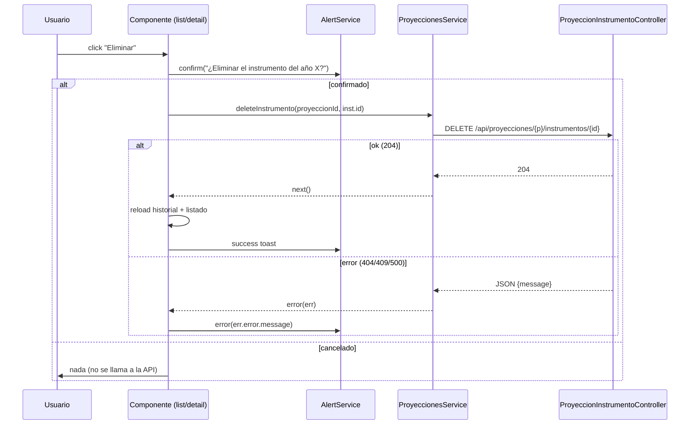

# Design: Eliminar instrumento del historial

## Architecture Decision

### ADR-1: Regla del último instrumento (409), no soft delete

**Contexto**: el listado de proyecciones (`ProyeccionController::index/byNivel`) arma las filas con `JOIN` contra `proyeccion_instrumentos` filtrando por el año en foco. Si una proyección se queda sin snapshots, desaparece del listado y de los stats, quedando huérfana (solo existiría la identidad base en `proyecciones`).

**Decisión**: bloquear la eliminación del último instrumento con 409 Conflict. Si la plaza dejó de existir, se borra la proyección completa (cuyo DELETE arrastra el historial por `onDelete('cascade')`).

**Alternativa descartada**: soft deletes — agrega complejidad (columna `deleted_at`, filtros en joins, stats) sin necesidad actual; el historial es un snapshot de datos legales, no una papelera.

### ADR-2: Endpoint anidado, no ApiResource con destroy propio

**Contexto**: la ruta DELETE sigue el patrón de las rutas anidadas existentes de instrumentos.

**Decisión**: `Route::delete('proyecciones/{proyeccion}/instrumentos/{instrumento}', ...)` con resolución por binding implícito, igual que `update`. Validación de pertenencia manual con `abort_unless` (mismo patrón que `update`).

## Flujo (frontend → backend)

## Reglas de UI

- Botón deshabilitado con `[disabled]="(historialInstrumentos|instrumentos)().length <= 1"` y tooltip explicativo.
- Mismo patrón `.btn-delete` que `.btn-edit`, con hover rojo (`#dc2626`) para señal de peligro.
- En el detalle, el `<td>` de acciones fusiona PDF + Editar + Eliminar en una celda (el thead tiene 11 columnas).

## Archivos

| Archivo | Cambio |
|---------|--------|
| `ProyeccionInstrumentoController.php` | +`destroy` |
| `routes/api.php` | +ruta DELETE |
| `proyecciones.service.ts` | +`deleteInstrumento` |
| `proyecciones-list.component.ts` | +botón + método `eliminarInstrumento` + estilos |
| `proyeccion-detail.component.ts` | +botón + método + `AlertService` inyectado + estilos + colspan corregido |